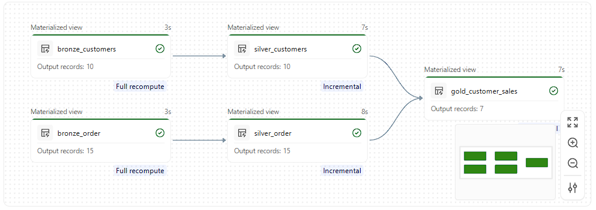
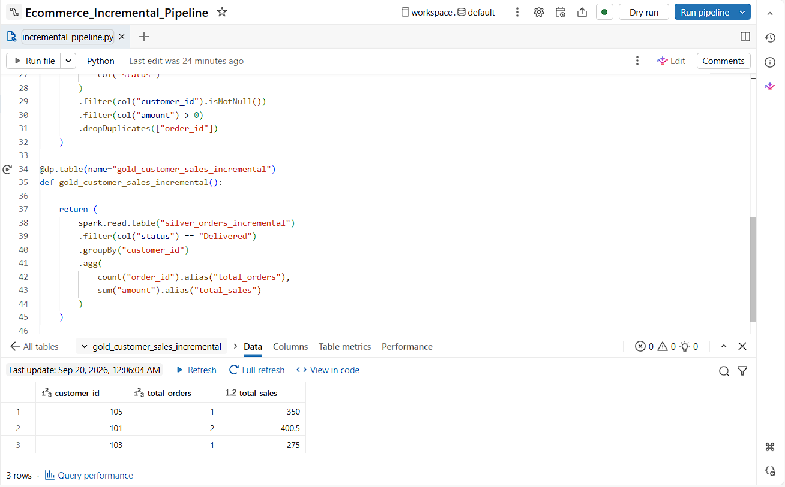

# E-commerce Data Engineering Pipeline

## Project Overview

This project demonstrates an end-to-end data engineering pipeline built using Databricks, PySpark, Lakeflow Pipelines, and Lakeflow Jobs.

The project processes customer and order data using a Medallion Architecture consisting of Bronze, Silver, and Gold layers.

The final output provides customer-level sales information for delivered orders.

## Architecture

```text
Customer CSV ──> Bronze Customers ──> Silver Customers ──┐
                                                          │
Order CSV ─────> Bronze Orders ────> Silver Orders ──────┤
                                                          ↓
                                                Gold Customer Sales
                                                          ↓
                                                 Data Validation
```

## Technologies Used

- Databricks
- PySpark
- Apache Spark
- Lakeflow Pipelines
- Lakeflow Jobs
- Unity Catalog
- Python
- SQL
- Delta Lake
- Medallion Architecture

## Source Data

The pipeline uses two CSV datasets:

### Customer Data

Contains customer information such as:
- Customer ID
- Customer Name
- City

### Order Data

Contains order information such as:
- Order ID
- Customer ID
- Order Amount
- Order Date
- Order Status

The project uses synthetic data created specifically for learning and portfolio demonstration.

## Bronze Layer

The Bronze layer ingests the raw CSV files into the Databricks pipeline.

- `bronze_customers` contains the customer source data.
- `bronze_order` contains the order source data.

The Bronze layer performs minimal transformation so that the source data remains available for downstream processing.

## Silver Layer

The Silver layer performs data cleansing and standardization.

### Silver Customers

- Cast `customer_id` to integer
- Rename `name` to `customer_name`
- Retain customer city
- Remove duplicate customer records based on `customer_id`

### Silver Orders

- Cast `order_id` to integer
- Cast `customer_id` to integer
- Cast `amount` to double
- Convert `order_date` to date
- Remove records with null customer IDs
- Remove records with non-positive amounts
- Remove duplicate orders based on `order_id`

## Gold Layer

Customer and order datasets are joined using `customer_id`.

Only orders with `Delivered` status are included in the final sales aggregation.

The data is grouped by:
- Customer ID
- Customer Name
- City

The following metrics are calculated:
- Total Orders
- Total Sales

The resulting dataset is stored as `gold_customer_sales`.

## Pipeline Flow

```text
bronze_customers
       │
       ▼
silver_customers
       │
       ├──────────────┐
                      │
                      ▼
              gold_customer_sales
                      ▲
                      │
       ┌──────────────┘
       │
silver_order
       ▲
       │
bronze_order
```

## Workflow Orchestration

A Lakeflow Job is used to orchestrate the pipeline and subsequent validation.

The workflow contains two tasks:

1. Run the Ecommerce ETL Pipeline
2. Validate the Ecommerce Data

```text
Run Ecommerce Pipeline
          │
          ▼
Validate Ecommerce Data
```

The validation task runs only after the pipeline task succeeds.

## Data Quality Validation

The validation notebook performs the following checks:

### Check 1 — Gold table is not empty

```python
assert df.count() > 0
```

### Check 2 — Sales should not be negative

```python
assert df.filter("total_sales < 0").count() == 0
```

### Check 3 — Order count should be positive

```python
assert df.filter("total_orders <= 0").count() == 0
```

If all checks pass:

```text
Data quality checks passed successfully!
```

## Project Result

The pipeline successfully processes the customer and order datasets through the Bronze, Silver, and Gold layers.

The Gold layer produces a customer-level sales summary containing:

| Column | Description |
|---|---|
| customer_id | Unique customer identifier |
| customer_name | Customer name |
| city | Customer city |
| total_orders | Number of delivered orders |
| total_sales | Total delivered sales amount |

The Lakeflow Job successfully executes the pipeline followed by the data-quality validation notebook.

## Pipeline Execution

The repository contains screenshots demonstrating the successful pipeline execution.

### Pipeline Graph

The pipeline graph shows the Bronze → Silver → Gold dependency structure and successful dataset processing.



### Workflow Execution

The workflow screenshot shows the successful execution of the pipeline task followed by the validation task.


## Project Structure

```text
databricks-ecommerce-etl/
│
├── README.md
│
├── src/
│   └── ecommerce_pipeline.py
│
├── Documentation/
│   └── Project_Overview.docx
│
└── Screenshots/
    ├── Pipeline_Graph.png
    └── Workflow_Run.png
```

## Learning Objectives

This project demonstrates practical hands-on experience with:

- Databricks
- PySpark
- Apache Spark
- Medallion Architecture
- Bronze, Silver, and Gold data layers
- Lakeflow Pipelines
- Lakeflow Jobs
- Unity Catalog
- Data transformation
- Data cleansing
- Deduplication
- Data validation
- Pipeline dependency management
- Workflow orchestration

## Future Enhancements

The pipeline can be extended with:

- Incremental data loading
- Change Data Capture (CDC)
- Slowly Changing Dimensions (SCD Type 2)
- Delta Lake MERGE operations
- Data quality expectations
- Pipeline parameterization
- Performance optimization
- Partitioning
- Job scheduling
- Monitoring and alerting
- Git-based CI/CD deployment

### Incremental Load Result

The incremental pipeline processes newly arriving order files and updates the downstream Silver and Gold datasets.



## Data Disclaimer

This project uses synthetic/sample data created for learning and portfolio demonstration purposes.

No production data, customer information, credentials, access tokens, or confidential company information is included.

## Author

**Saurabh Mitra**

Data Engineering | Azure | Databricks | PySpark | SQL
